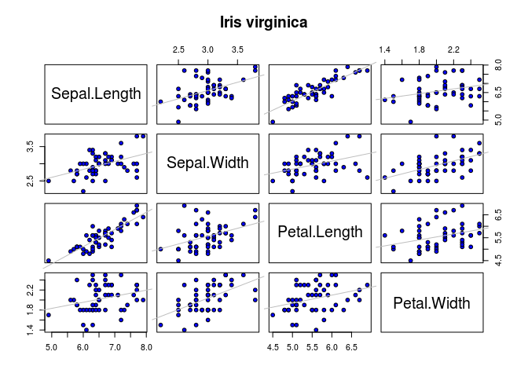

# k-means and k-NN
================
In this tutorial I will explain how to use Kmeans and KNN withing an application. This tutorial was part of my course project for Data Science course with Prof. Harner. 

This is well known dataset found in the pattern recognition literature. Fisher's paper is a classic in the field and is referenced frequently to this day. The data set contains 3 classes of 50 instances each, where each class refers to the type of iris plant.

Predicted attribute: class of iris plant.

Attribute Information:
\* sepal length in cm
\* sepal width in cm
\* petal length in cm
\* petal width in cm
\* Iris species: Setosa; Versicolour; Virginica

1 Compute summary statistics and plot a scatterplot matrix for each of the three iris species. `Species` is a factor and the other variables are numberic.

``` r
data(iris)
attach(iris)
```

``` r
pairs(iris[1:4], main = "Iris Data(ALtogether)", pch = 21, bg = c("red", "green3", "blue")[unclass(iris$Species)],panel = function (x, y, ...) {
    points(x, y, ...)
    abline(lm(y ~ x), col = "grey")
    });  par(xpd=TRUE);   legend(0,.4 , as.vector(unique(iris$Species)), fill=c("red", "green3", "blue"))
```


``` r
irisSetosa <- iris[iris$Species=="setosa",]
irisSetosa$Species <- NULL
pairs(irisSetosa[1:4], main = "Iris Setosa", pch = 21, bg = c("red"),panel = function (x, y, ...) {
    points(x, y, ...)
    abline(lm(y ~ x), col = "grey")
    })
```


``` r
irisVersi <- iris[iris$Species=="versicolor",]
irisVersi$Species <- NULL
pairs(irisVersi[1:4], main = "Iris versicolor", pch = 21, bg = c("green3"),panel = function (x, y, ...) {
    points(x, y, ...)
    abline(lm(y ~ x), col = "grey")
    })
```


``` r
irisVirginica <- iris[iris$Species=="virginica",]
irisVirginica $Species <- NULL
pairs(irisVirginica [1:4], main = "Iris virginica", pch = 21, bg = c("blue"),panel = function (x, y, ...) {
    points(x, y, ...)
    abline(lm(y ~ x), col = "grey")
    })
```



## 2 Create a logical variable `train` and add this to the `iris` data frame. Randomly sample 35 observations from each of the species and label these `TRUE`. Label the remaining 15 in each group (species) `FALSE`. The training and test observations should remain fixed for the remainder of the analysis. For convenience subset the sample into training and testing data frames.

``` r
# Put your R code here.
train1 <- sample(1:50, 35, replace=FALSE)
train2 <- sample(51:100, 35, replace=FALSE)
train3 <- sample(101:150, 35, replace=FALSE)

test1 <- setdiff(1:50, train1)
test2 <- setdiff(51:100, train2)
test3 <- setdiff(101:150, train3)


train11 <- iris[train1,] # or train12 <- subset(iris[train1, ])
train11$train <- rep.int(TRUE,35)
test11 <- iris[test1,]
test11$train <-rep.int(FALSE,15)
setosa <- rbind(train11,test11)

train22 <- iris[train2,] # or train12 <- subset(iris[train1, ])
train22$train <- rep.int(TRUE,35)
test22 <- iris[test2,]
test22$train <-rep.int(FALSE,15)
versicolor <- rbind(train22,test22)

train33 <- iris[train3,] # or train12 <- subset(iris[train1, ])
train33$train <- rep.int(TRUE,35)
test33 <- iris[test3,]
test33$train <-rep.int(FALSE,15)
virginica <- rbind(train33,test33)

traina <- rbind(train11,train22,train33)
testa <- rbind(test11,test22,test33)
true.labelsa <- testa$Species
```

## 3 Perform an average linkage hierarchical cluster analysis on the training data frame without consideration of the species groupings and cut the tree at 3 groups. Provide relevant graphical and numerical summeries.

``` r
traind <- traina
traind$Species <- NULL
traind$train <- NULL
traina.sc <- scale(traind)
traina.dis <- dist(traina.sc)
h.averagea <- hclust(traina.dis, method="average")
plot(h.averagea, ann = F , labels = traina$Species )
rect.hclust(h.averagea, k=3)
```


``` r
cutree(h.averagea, 3)
```

    ##  36   9  13  39  11  38  44  41   7  30  37   2  27  12  21  28  10  25 
    ##   1   1   1   1   1   1   1   1   1   1   1   1   1   1   1   1   1   1 
    ##  43  48  42  46   8  19  22  45  49  24  29   1   3   5  23  16  15  88 
    ##   1   1   2   1   1   1   1   1   1   1   1   1   1   1   1   1   1   3 
    ##  60  82  66  81  59  84  70  95  79  62  54  93  52  71  78  53  72  67 
    ##   3   3   3   3   3   3   3   3   3   3   3   3   3   3   3   3   3   3 
    ##  58  76  90  73  75  63  61  56  80  97  68  86  99 100  85  65 118 124 
    ##   3   3   3   3   3   3   3   3   3   3   3   3   3   3   3   3   3   3 
    ## 112 141 128 131 110 147 107 144 119 133 145 122 120 106 130 134 114 146 
    ##   3   3   3   3   3   3   3   3   3   3   3   3   3   3   3   3   3   3 
    ## 127 102 126 123 115 101 142 125 116 135 103 136 108 105 140 
    ##   3   3   3   3   3   3   3   3   3   3   3   3   3   3   3

``` r
initial.pointsa <- tapply(traina.sc, list(rep(cutree(h.averagea, 3), ncol(traina.sc)), col(traina.sc)), mean)
dimnames(initial.pointsa) <- list(NULL, dimnames(traina.sc)[[2]])
initial.pointsa
```

    ##      Sepal.Length Sepal.Width Petal.Length Petal.Width
    ## [1,]   -0.9651938   0.9343807   -1.2802922  -1.2388124
    ## [2,]   -1.5428257  -1.6734422   -1.3708956  -1.1701952
    ## [3,]    0.4908488  -0.4299358    0.6414404   0.6184259

## 4 Cluster the training data using the *k*-means algorithm for *k* = 3 groups using the hierarchical cluster results above for the seed points. Provide PCA summaries of the results. Discuss the agreement between the true groups and the groups found by the *k*-means algorithm.

``` r
trainb.sc <- traina.sc
initial.pointsb <- initial.pointsa
kmeansa <- kmeans(trainb.sc,initial.pointsb)
kmeansa$centers
```

    ##   Sepal.Length Sepal.Width Petal.Length Petal.Width
    ## 1   -0.9816975   0.8598715   -1.2828809  -1.2368519
    ## 2   -0.0678530  -0.8958267    0.3323632   0.2754573
    ## 3    1.1937316   0.1561851    1.0302796   1.0499026

``` r
kmeansa$cluster  # the clusters found by k-means are NOT identical to those found by cutting the average-linkage tree into three grpups.
```

    ##  36   9  13  39  11  38  44  41   7  30  37   2  27  12  21  28  10  25 
    ##   1   1   1   1   1   1   1   1   1   1   1   1   1   1   1   1   1   1 
    ##  43  48  42  46   8  19  22  45  49  24  29   1   3   5  23  16  15  88 
    ##   1   1   1   1   1   1   1   1   1   1   1   1   1   1   1   1   1   2 
    ##  60  82  66  81  59  84  70  95  79  62  54  93  52  71  78  53  72  67 
    ##   2   2   3   2   2   2   2   2   2   2   2   2   3   3   3   3   2   2 
    ##  58  76  90  73  75  63  61  56  80  97  68  86  99 100  85  65 118 124 
    ##   2   3   2   2   2   2   2   2   2   2   2   3   2   2   2   2   3   2 
    ## 112 141 128 131 110 147 107 144 119 133 145 122 120 106 130 134 114 146 
    ##   3   3   3   3   3   2   2   3   3   3   3   2   2   3   3   2   2   3 
    ## 127 102 126 123 115 101 142 125 116 135 103 136 108 105 140 
    ##   2   2   3   3   2   3   3   3   3   2   3   3   3   3   3

``` r
table(kmeansa$cluster,as.numeric(traina$Species))
```

    ##    
    ##      1  2  3
    ##   1 35  0  0
    ##   2  0 28 11
    ##   3  0  7 24

``` r
# for group 2 and 3 it is not good but for group one it is perfect

kmeans.pca <- princomp(trainb.sc)
kmeans.pca.pred <- predict(kmeans.pca)
kmeans.pca.centers <- predict(kmeans.pca, kmeansa$centers)
plot(kmeans.pca.pred[, 1:2], type="n", xlab = "Canonical PCA 1", ylab = "Canonical PCA 2")
text(kmeans.pca.pred[, 1:2], labels = kmeansa$cluster)
points(kmeans.pca.centers[, 1:2], pch = 3, cex = 3)
```


``` r
screeplot(kmeans.pca, type = "lines")
```


``` r
biplot(kmeans.pca, pc.biplot = FALSE)
```


5 Perform a *k*-NN classification using *k* = 2 nearest neighbors for the three groups. Compute and discuss the confusion matrix based on the test data frame.

``` r
# Put your R code here.
library(class)
trainb <- traina
trainb$Species <- NULL ; trainb$train <- NULL
testb <- testa
testb$Species <- NULL ; testb$train<- NULL
(diabetes.knn <- knn (trainb, testb, traina$Species, k=2)) ;
```

    ##  [1] setosa     setosa     setosa     setosa     setosa     setosa    
    ##  [7] setosa     setosa     setosa     setosa     setosa     setosa    
    ## [13] setosa     setosa     setosa     versicolor versicolor versicolor
    ## [19] virginica  versicolor versicolor versicolor versicolor versicolor
    ## [25] versicolor versicolor versicolor versicolor versicolor versicolor
    ## [31] virginica  virginica  virginica  virginica  virginica  virginica 
    ## [37] virginica  virginica  virginica  virginica  versicolor virginica 
    ## [43] virginica  virginica  virginica 
    ## Levels: setosa versicolor virginica

``` r
table(diabetes.knn,true.labelsa)
```

    ##             true.labelsa
    ## diabetes.knn setosa versicolor virginica
    ##   setosa         15          0         0
    ##   versicolor      0         14         1
    ##   virginica       0          1        14

6 Determine the optimal *k*, i.e., the number of nearest neighbors, for the three-group problem using the confusion matrix computed on the test data frame in each case. Discuss.

``` r
# Put your R code here.
ratea <- c()
n.testa <- length(testa[,1])

for (k in 1:20) {
  predicted.labelsa <- knn(trainb, testb, traina$Species, k)
  n.incorrect.labelsa <- sum(predicted.labelsa != true.labelsa)
  misclassification.ratea <- n.incorrect.labelsa / n.testa
  ratea <- c(misclassification.ratea, ratea)
  
}
ratea
```

    ##  [1] 0.02222222 0.00000000 0.00000000 0.02222222 0.02222222 0.00000000
    ##  [7] 0.00000000 0.00000000 0.02222222 0.00000000 0.00000000 0.00000000
    ## [13] 0.00000000 0.02222222 0.00000000 0.04444444 0.04444444 0.02222222
    ## [19] 0.04444444 0.00000000

``` r
plot(1/(20:1), ratea, type="b", xlab="Flexibility (1/k)")
```


``` r
#According to the figure the optimal points easily can be chosen by looking at the figure (it is different for each run because the samples are random)
```
